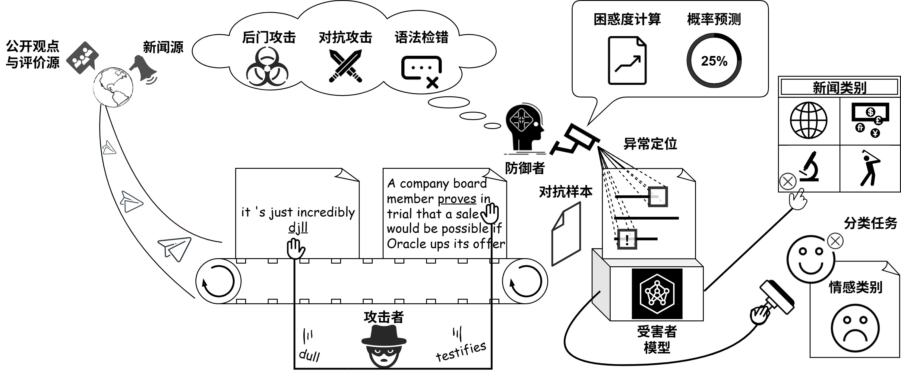

### :zap:Overview

### :flying_saucer:Instructions

> [!NOTE]
> 1. "xgboost" represents the _wdr_ method  in this project.
> 2. INFO of the software & hardware environment can be referenced [here](./environment.txt).
> 3. The combination results in Figure 5.8-5.11 can be obtained by running [`./FINAL_RESULT/combination_result/method_combine.py`](./FINAL_RESULT/combination_result/method_combine.py).
> 4. The distribution statistic in Table 5.7 and Figure 5.6 can be obtained in [`./FINAL_RESULT/prob_perplex_distribution`](./FINAL_RESULT/prob_perplex_distribution).

The main entrance of [our method](./FINAL_RESULT/evaluate_our.py) and comparison methods (python files began with `evaluate_`, and the entrance of _gector_ is [`predict.py`](./gector-master/predict.py)) and the final results (folders ended with `_result`) are all saved in [`./FINAL_RESULT`](./FINAL_RESULT).
___

#### For localizing Adversarial Perturbations

1. The code area is commented with "### FOR ADVERSARIAL EXAMPLE" at the beginning, and the results are saved in `ag-news` & `sst2` folders.
2. For defending TAEs generated by our method in Chapter 3 & 4, the main entrance is [here](./FINAL_RESULT/against_proposed_attack_method_result/defend_AdvCNER_NVJR.py), and the results are shown in Table 5.9.
___
#### For localizing Backdoor Triggers

The code area is commented with "### FOR BACKDOOR TRIGGERS" at the beginning, and the results are saved in `on_badnet`.
___
#### For localizing Grammatical Errors 

The code area is commented with "### FOR GRAMMATICAL ERRORS" at the beginning, and the results are saved in `on_GEC_FCE`.
___
#### For localizing Adversarial Prompts Perturbations

The code area is commented with "### FOR ADVERSARIAL PROMPT" at the beginning, and the results are saved in `on_prompt`.
___

### :bowling:ModelHub

The links for the model requiring prior download and the introductions of defense methods are provided below:

| Models  | Methods|
| ---------- | -----------|
|    | ours, [xgboost](https://github.com/javirandor/wdr)    |
|    | ours, [onion](https://github.com/thunlp/ONION), [rank](https://github.com/xinleihe/MGTBench/blob/main/methods/metric_based.py)   |
|    | [bfclass](https://arxiv.org/abs/2109.10855)   |
|    | [gector](https://github.com/grammarly/gector?tab=readme-ov-file#model-inference)   |
