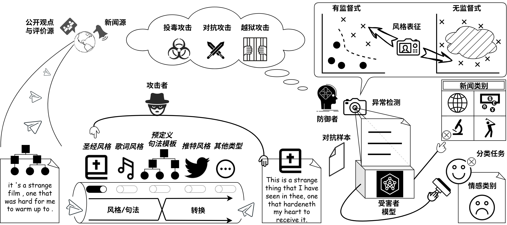

### :zap:Overview

  

### :flying_saucer:Instructions

> [!NOTE]
> 1. [`./style-transfer-model-evaluation-master`](./style-transfer-model-evaluation-master), [`./expression_diversity`](./expression_diversity) and [`./factual_consistency`](./factual_consistency) are the folders to evaluate _Content Preservation_, _Expression Diversity_ and _Factual Consistency_ of TAEs separately in Section 6.3.3(2).
> 2. INFO of the software & hardware environment can be referenced [here](./environment.txt).
> 3. Any writing stylistic embedding can be obtained individually by running [this file](./our_method_LUAR_obtain_stylistic_representation.py), and [here](https://github.com/LLNL/LUAR) is the home page of _LUAR_ which is the core model used in proposed method.

___

#### For defending Backdoor Poisoning attack
   

> [!NOTE]
The basic setting of _OpenBackdoor_ is reserved [here](./BadActs/README.md).

> [!IMPORTANT]
Before starting, please add our method in [`./BadActs/openbackdoor/defenders/__init__.py`](./BadActs/openbackdoor/defenders/__init__.py) and place [the python file](./BadActs/openbackdoor/defenders/stylistic_defender.py) in `./BadActs/openbackdoor/defenders/`.

1. For defending _Training-time_ poisoning attack, the [main entrance file](./BadActs/CUBE_correction.py) and results (json files ended with `-bert-{anything except "3"}` in [`./BadActs/defenders_result`](./BadActs/defenders_result), and figures in [`./BadActs/saved_figure/correction`](./BadActs/saved_figure/correction)) are given in this sentence.  

2. For defending _Inference-time_ poisoning attack, the [main entrance file](./BadActs/BadActs_detection.py) and results (json files ended with `-bert-3` in [`./BadActs/defenders_result`](./BadActs/defenders_result), and figures in [`./BadActs/saved_figure/detection`](./BadActs/saved_figure/detection)) are given in this sentence.  
___
#### For defending Adversarial attack
   

> [!NOTE]
The usage guideline of the _comparison method_ is reserved [here](./Distinguishing-Non-Natural-main/README.md).

The main entrance of [our method]((./our_method_adversarial_defense.py)) and the [comparison method](./Distinguishing-Non-Natural-main/src/train_detector_style_syntactic.sh) are given in this sentence. The results of _ideal scenario_ (original samples with their corresponding TAEs which is described in Page 91) are saved in folder ended with [`_corresponding_results`](./Distinguishing-Non-Natural-main/detection_corresponding_results) (figures are saved [here](./Distinguishing-Non-Natural-main/saved_figure_corresponding)), and the results of _simulated realistic scenarios_ (original samples and TAEs do not strictly correspond which is described in Page 93) are saved in folder ended with [`_results`](./Distinguishing-Non-Natural-main/detection_results) (figures are saved [here](./Distinguishing-Non-Natural-main/saved_figure)).

Additionally, for defending TAEs generated by our method in Chapter 3 & 4, the main entrance is [here](./against_proposed_attack_method_result/defend_AdvCNER_NVJR.py), and the results are shown in Table 6.13 and Figure 6.12.

___

#### For defending Jailbreak attack
  

> [!NOTE]
> 1. The description of the dataset is reserved [here](./jailbreak_llms-main/data/README.md).
> 2. The version of _Langkit_ is 0.0.28, and the original link to download `index_embeddings_all-MiniLM-L6-v2_harm_v1.npy` is no longer active. We have retained a copy [here](./jailbreak_llms-main/langkit/langkit_data), and files in [this folder](./jailbreak_llms-main/langkit) should be set in the installation directory of _Langkit_.

The [main entrance](./our_method_jailbreak_defense.py) of our method and comparison methods and [experimental results](./jailbreak_llms-main/result.txt) (figures are saved [here](./BadActs/saved_figure/jailbreak)) are given in this sentence.

___

### :bowling:ModelHub

The download links for base models which will be used in the experiment are provided below:

